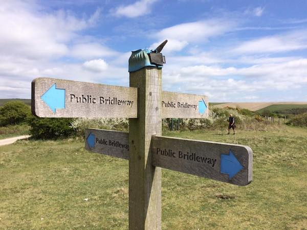

# Signposts

A system which allows professionals in the public sector to perform searches of numerous agencies' records for fair and proportionate purposes, such as safeguarding children. 

For further information and 'getting started' info for developers see [the documentation](docs/index.md).
